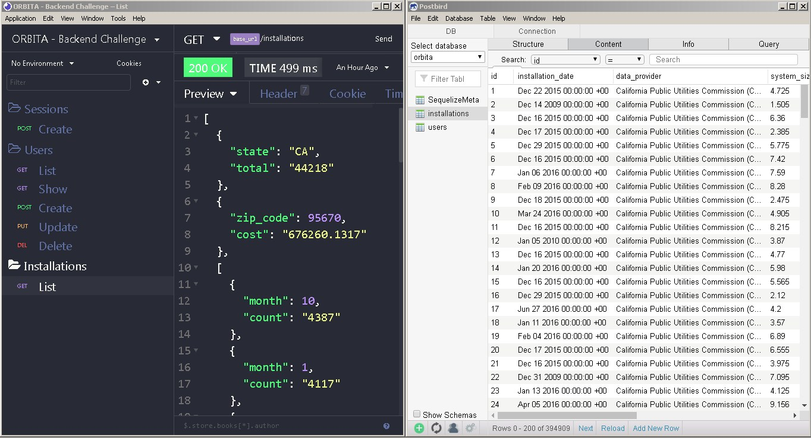

# Orbita Backend

> Desafio de backend para a vaga de Software Developer da Orbita Energy.

## Instalação

1 - Criar banco de dados **orbita** no Postgres com Docker:

`docker-compose up`

2 - Criar tabelas **users e installations** no banco de dados:

`yarn dbmigrate`

3 - Insertir dados na tabela **installations**:

`yarn dbinserts`

## Iniciar API

Obs.: A variável de ambiente DB_HOST no arquivo .end está com o ip `192.168.99.100` (meu docker funciona com essa configuração).
Dependendo de como seu docker está configurado altere esse ip para `localhost`.

1 - Verificar se o container **orbita-postgres** está ativo:

`docker ps`

Caso não esteja ativo Rodar o comando: `docker start orbita-postgres`

2 - Rodar o comando:

`yarn start`

API ficará diponível para qualquer client (Insomina, Postman, Aplicação web ou mobile) em => `http://localhost:3333`

## Testes

1 - Setar variável de ambiente (via linha de comando):

`NODE_ENV=test`

2 - Rodar o comando:

`yarn test`

Para ter uma visão completa dos testes abra o arquivo: `backend/__tests__/coverage/lcov-report/index.html`

## Extra

Arquivo de configuração da ferramenta insomania com todas as rotas organizadas por pastas:

[Insomnia.json](https://github.com/renanbrenovital/orbita-backend/blob/master/Insomnia.json)
